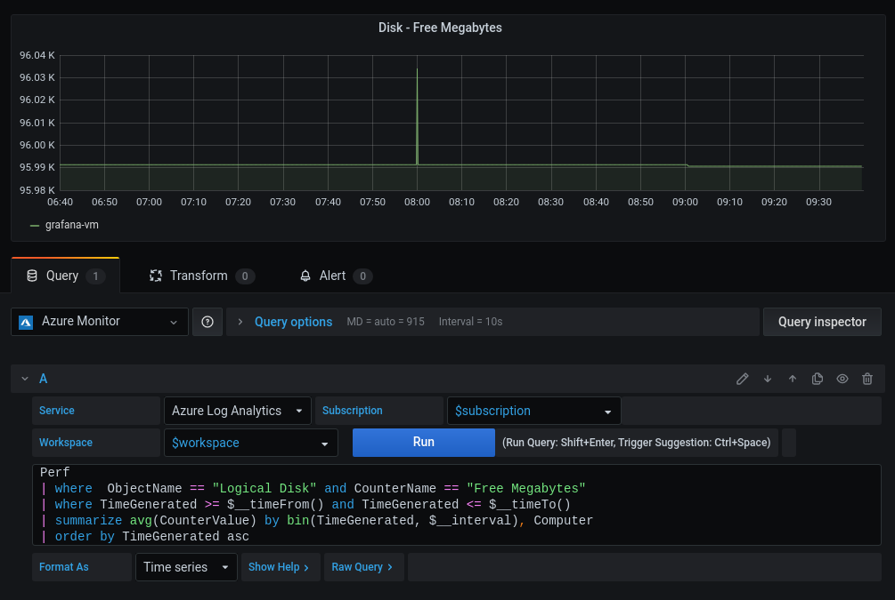
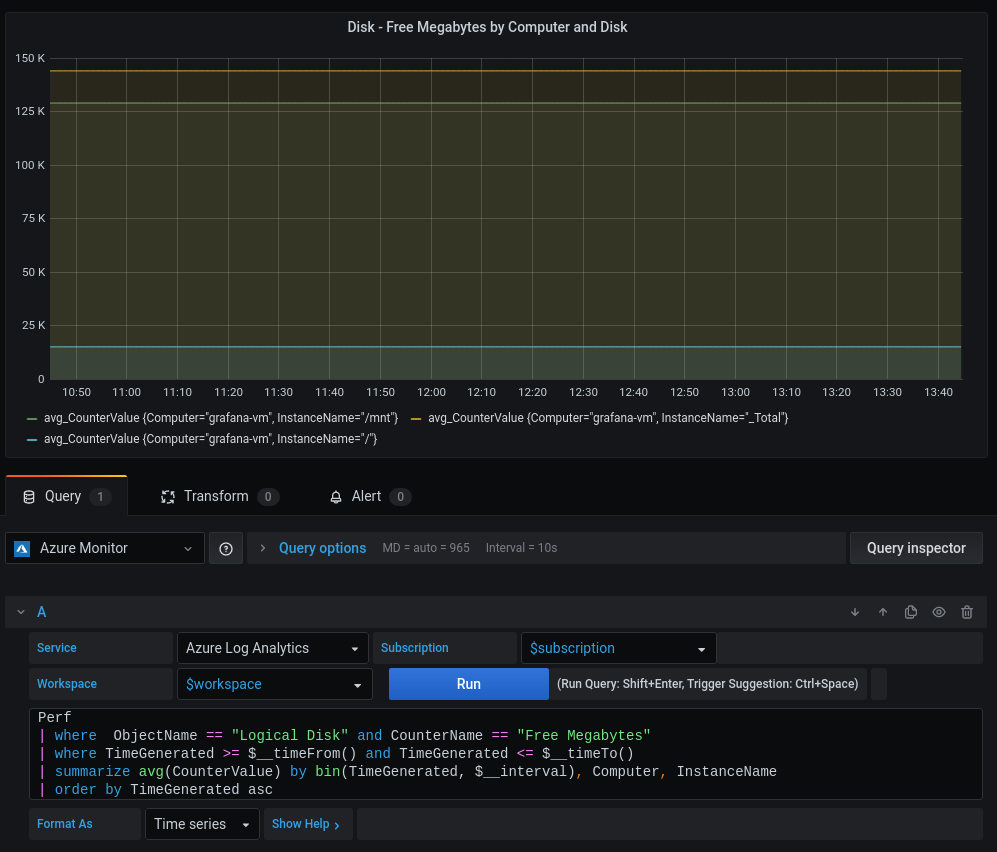
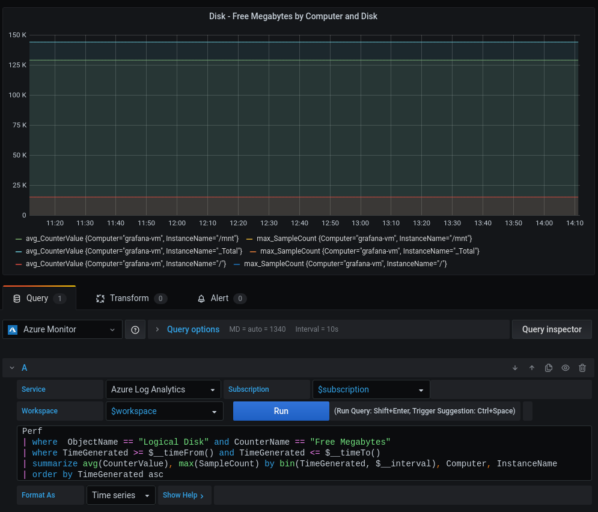

# Azure Monitor data source dimensions feature in 7.1

The Azure Monitor datasource now supports multiple dimensions for time series queries. This allows you to group by multiple parameters when previously you could group by one one.

## Azure Monitor Service

## Application Insights Service

## Log Analytics and Application Insights Analytics Services

Before 7.1, when creating time series queries (by selecting "Format At" to "Time series"), the final result could have only one Number (metric) column and one Dimension (non-number) column to create the time result for Log Analytics and Application Insights Analytics. 

Since both of these Azure services are based on the [Kusto query language](https://docs.microsoft.com/en-us/azure/data-explorer/kusto/query/), Application Insights Analytics has been moved to its own service the behaves the same way as Log analytics in 7.1.

### Pre 7.1

For example, the following query works before 7.0, and returns one time series per `Computer`, where `Computer` is considered a dimension.

```kusto
Perf
| where  ObjectName == "Logical Disk" and CounterName == "Free Megabytes"
| where TimeGenerated >= $__timeFrom() and TimeGenerated <= $__timeTo()
| summarize avg(CounterValue) by bin(TimeGenerated, $__interval), Computer
| order by TimeGenerated asc
```



### Post 7.1

Since 7.1, the `summarize` line can be changed to include more dimensions, such as adding InstanceName to the summarize statement from the previous query:

```kusto
| summarize avg(CounterValue) by bin(TimeGenerated, $__interval), Computer, InstanceName
```



It is also possible to query multiple metrics in a single query, or multiple metrics and multiple dimensions. This is a more advanced and likely less commonly used use case as it can return a large number of series. But this can be useful, in particular with [dashboard queries](https://grafana.com/docs/grafana/latest/panels/queries/#data-source-selector) to use results in other panels.

For example, if we update the `summarize` statement yet again we can include another value column:

```kusto
| summarize avg(CounterValue), max(SampleCount) by bin(TimeGenerated, $__interval), Computer, InstanceName
```




### How it works

When selecting "Format As" in the query editor to "Time series", Grafana does additional data processing to the response from the two Analytics services. This process reformats the data into a time series model Grafana understands. You can bypass this by selecting "Format As" as "Table" to see the table response as returned by the Azure services without this processing.

These services return a table response that consists of columns and rows. For each item selected in your query, the response includes the type of the column. For the purposes of time series formatting, we care about three categories of types:

 1. Time: Datetime
 2. Metric: Number (e.g. float, int, etc)
 3. Dimensions: Other Type (e.g. boolean, string)

For each unique combination of Metric and Dimensions, a time series is created.

#### Details of each type

Depending on the type of column in the result, it is considered a Time Column, a Metric Column, or a Dimension Column.

##### Time

The first datetime column found in the response will be the time index for all the series found in the response. The response must be sorted by the time column in ascending order.

(Note: If there are additional time columns, they will be turned in Metric/Number columns that have been converted to epoch, and you probably do not want to do that).

##### Metric

Any number type columns are considered to be a metrics. The name of the metric will be the name of the number column in the response.

##### Dimensions

Any other types of columns will become dimensions for the metric. The most common type would be a string column. A dimension ends up as a key=value pair. The key comes from the name of the column, the value will be from the values of that column.

Having dimensions is optional for a query.

#### Example

Taking the summarize line from our example query that includes a single metric and multiple dimensions:

```kusto
| summarize avg(CounterValue) by bin(TimeGenerated, $__interval), Computer, InstanceName
```

Series will be produced like:

```
avg_CounterValue {Computer="myHost", InstanceName="/"}
avg_CounterValue {Computer="myOtherHost", InstanceName="c"}
avg_CounterValue {Computer="myOtherHost", InstanceName="d"}
...
```

Where `avg_CounterValue` was a Number valued column and came from `avg(CounterValue)`, and the dimensions are `{Computer="myHost", InstanceName="/"}`. Which omes from selecting the columns `Computer` and `InstanceName`. The values, `myHost` and `/` come from the rows of their respective columns.